<p align="center">
  
</p>

<h1 align="center">Merhaba, ben Gökdağ Kandemir 👋</h1>

<h3 align="center">Vibe Coder • Web • AI</h3>

<p align="center">
  <strong>Yapay zekâ destekli geliştirme ile fikirleri modern web projelerine dönüştürüyorum.</strong>
</p>

<p align="center">
  <a href="mailto:kandemirgokdag@gmail.com">
    
  </a>
</p>

---

## 👨‍💻 Hakkımda

* 🌐 Genellikle **web siteleri ve web projeleri** geliştiriyorum.
* 🤖 Projelerimde **yapay zekâ destekli geliştirme** araçlarını aktif olarak kullanıyorum.
* ⚡ Fikirleri hızlı bir şekilde çalışan projelere dönüştürmeyi seviyorum.
* 🎨 Modern, sade ve kullanıcı odaklı arayüzler tasarlıyorum.
* 🧠 Yeni teknolojileri deneyerek ve yapay zekâdan destek alarak öğreniyorum.
* 🚀 Özellikle modern ve profesyonel görünen web projeleri üzerinde çalışıyorum.
* 💡 Kendimi klasik anlamda bir yazılımcıdan çok **Vibe Coder** olarak görüyorum.

---

## 🤖 AI + Vibe Coding

Yapay zekâ, geliştirme sürecimin önemli bir parçası.

Fikir oluştururken, tasarım yaparken, kod geliştirirken, hataları çözerken ve yeni teknolojileri öğrenirken AI araçlarından yararlanıyorum.

```text
💡 Fikir
   ↓
🤖 AI ile Planlama
   ↓
🎨 Tasarım
   ↓
💻 Vibe Coding
   ↓
🧪 Test
   ↓
⚡ Geliştirme
   ↓
🚀 Yayınlama
```

Benim için amaç sadece kod yazmak değil;

**bir fikri mümkün olduğunca hızlı şekilde çalışan ve kullanılabilir bir projeye dönüştürmek.**

---

## 🌐 Neler Yapıyorum?

```text
Web Geliştirme
├── Modern Web Siteleri
├── Landing Page'ler
├── Portfolyo Siteleri
├── Yönetim Panelleri
├── SaaS Arayüzleri
└── Responsive Web Projeleri

AI Destekli Geliştirme
├── AI ile Kodlama
├── Vibe Coding
├── Hızlı Prototipleme
├── AI Entegrasyonları
└── Hata Çözme & Optimizasyon

Tasarım
├── Modern UI
├── Dark Mode
├── Glassmorphism
├── Animasyonlar
└── Kullanıcı Deneyimi
```

---

## 🛠️ Teknolojiler

### 🎨 Frontend

<p align="left">

<a href="https://developer.mozilla.org/en-US/docs/Web/HTML">

</a>

<a href="https://developer.mozilla.org/en-US/docs/Web/CSS">

</a>

<a href="https://developer.mozilla.org/en-US/docs/Web/JavaScript">

</a>

<a href="https://www.typescriptlang.org/">

</a>

<a href="https://react.dev/">

</a>

<a href="https://nextjs.org/">

</a>

</p>

---

### ⚙️ Backend & Web

<p align="left">

<a href="https://nodejs.org/">

</a>

<a href="https://expressjs.com/">

</a>

<a href="https://www.python.org/">

</a>

<a href="https://www.php.net/">

</a>

</p>

---

### 🗄️ Veritabanları

<p align="left">

<a href="https://www.mysql.com/">

</a>

<a href="https://www.postgresql.org/">

</a>

<a href="https://firebase.google.com/">

</a>

</p>

---

### ☁️ Araçlar & Altyapı

<p align="left">

<a href="https://git-scm.com/">

</a>

<a href="https://www.docker.com/">

</a>

<a href="https://www.linux.org/">

</a>

<a href="https://www.nginx.com/">

</a>

</p>

---

## 🚀 Üzerinde Çalıştığım Alanlar

```text
🌐 Web
   ├── Modern Web Siteleri
   ├── Frontend Projeleri
   ├── Full-Stack Projeler
   ├── Dashboard'lar
   └── SaaS Projeleri

🤖 Yapay Zekâ
   ├── AI Assisted Coding
   ├── Vibe Coding
   ├── AI Entegrasyonları
   └── AI ile Prototipleme

🎨 Tasarım
   ├── Modern UI
   ├── Responsive Tasarım
   ├── Dark Interface
   └── Web Animasyonları
```

---

## 📊 GitHub İstatistikleri

<p align="center">
  
  
</p>

---

## 🧩 Geliştirme Anlayışım

> **Bir fikir bul.**
>
> **Yapay zekâdan destek al.**
>
> **Tasarla.**
>
> **Üret.**
>
> **Deneyerek geliştir.**
>
> **Yayınla.**

Benim için geliştirme süreci sadece kod yazmaktan ibaret değil.

Bir fikri ortaya çıkarmak, tasarlamak, yapay zekâdan destek almak, ortaya çıkan sonucu test etmek ve sürekli geliştirmek benim çalışma şeklim.

---

## ⚡ Şu Anda

```text
🌐 Web siteleri geliştiriyorum
🤖 Yapay zekâ destekli projeler yapıyorum
🎨 Modern arayüzler tasarlıyorum
🧠 Yeni teknolojileri deneyerek öğreniyorum
💻 Vibe Coding ile projeler geliştiriyorum
🚀 Yeni fikirleri gerçek projelere dönüştürüyorum
```

---

## 📫 İletişim

<p align="center">

<a href="mailto:kandemirgokdag@gmail.com">
  
</a>

</p>

---

<h3 align="center">💻 Gökdağ Kandemir</h3>

<p align="center">
  <strong>Vibe Coder • Web • AI</strong>
</p>

<p align="center">
  <i>Fikirlerden web sitelerine.</i>
</p>
